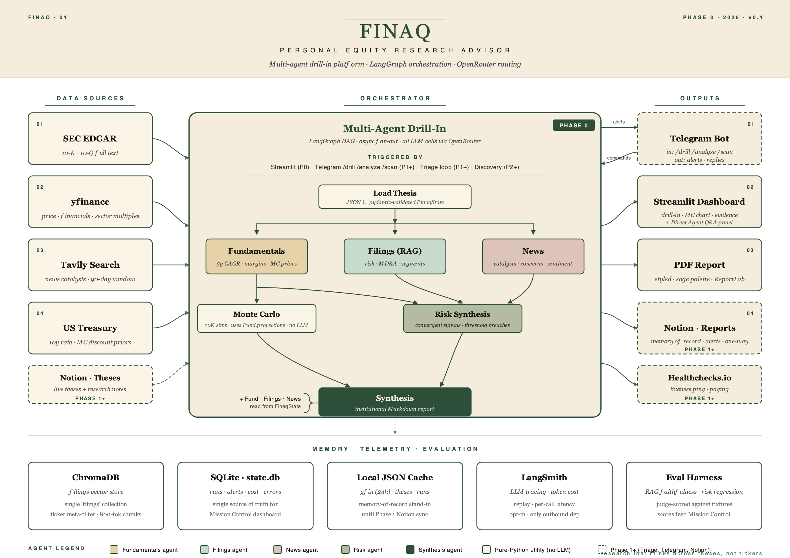
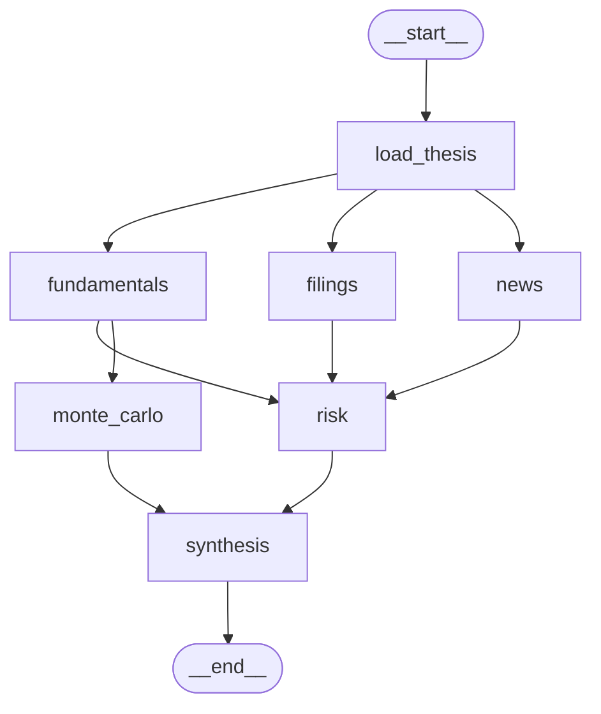

# FINAQ

**Open-source equity research where every claim is cited, every retrieval is evaluated, and the math is auditable.**

Multi-agent drill-in over SEC filings, fundamentals, and news — orchestrated with LangGraph, retrieved with hybrid BM25 + cosine + RRF, valued with a 10,000-sample hybrid Monte Carlo, and synthesised into a 9-section report in 3–5 minutes on your laptop.

[](./LICENSE)
[](https://www.python.org/)
[](https://github.com/langchain-ai/langgraph)
[](https://www.trychroma.com/)
[](https://openrouter.ai/)
[](#stack)



---

## The 30-second pitch

**The problem.** AI for equity research today is a bad bet. LLM chatbots hallucinate confidently; closed terminals (Bloomberg AI, FinChat) are black-boxes that cost thousands a month; open-source RAG demos ship with one vector index, no faithfulness check, and no honest comparison set. Investing decisions need citations, not vibes.

**The approach.** A LangGraph drill-in. Three workers — Fundamentals, Filings, News — fan out in parallel. A Risk node synthesises cross-modally, looking for convergent signals (≥2 agents agree), threshold breaches against your thesis, and divergent evidence. A 10,000-sample Monte Carlo runs in parallel with Risk. A Synthesis node produces a 9-section markdown report with a plain-English "What this means" section, a sized action recommendation, and a forward-looking watchlist. Every claim carries an `Evidence` with `source`, `accession`, `url`, and an `as_of` date.

**Why it converts.** Locally runnable on a laptop — no cloud, no daemon, no telemetry. One env var per agent (`MODEL_FUNDAMENTALS`, `MODEL_FILINGS`, …) — swap Claude / GPT / Gemini / Llama in seconds without code changes. ~$0.05–0.15 per drill-in in API costs at default models. Apache 2.0.

---

## What makes FINAQ different

|                                                       | LLM chatbot | Naive RAG demo | Closed platform | **FINAQ** |
| ----------------------------------------------------- | :---------: | :------------: | :-------------: | :-------: |
| Citation-grounded outputs (chunk + accession + date)  |     no      |     partial    |       yes       |  **yes**  |
| Three-tier RAG eval (deterministic + LLM-judge + RAGAS) |   no      |       no       |     opaque      |  **yes**  |
| Hybrid retrieval (cosine + BM25 + RRF)                |     no      |       no       |     opaque      |  **yes**  |
| Cross-modal convergent-signal synthesis               |     no      |       no       |     opaque      |  **yes**  |
| Auditable Monte Carlo (lognormal multiples + sensitivity) |   no    |       no       |     opaque      |  **yes**  |
| Local + open-source + LLM-swappable                   |     no      |     partial    |       no        |  **yes**  |

---

## Quickstart (5 minutes)

```bash
git clone https://github.com/juanjtov/finaq.git && cd finaq
python -m venv .venv && source .venv/bin/activate
pip install -r requirements.txt        # or: uv pip install -r requirements.txt
cp .env.example .env && $EDITOR .env   # add OPENROUTER_API_KEY, TAVILY_API_KEY, SEC_EDGAR_USER_AGENT
python scripts/ingest_universe.py      # one-time, ~10 min for 11-ticker AI cake universe
streamlit run ui/app.py                # http://localhost:8501
```

Pick a thesis (`ai_cake`, `nvda_halo`, `construction`), enter a ticker, click **Run drill-in**. First run on a real ticker takes 3–5 minutes; subsequent runs on the same `(ticker, thesis)` pair are cached in `data_cache/demos/` and load instantly.

For a visual graph debugger, run `langgraph dev` (registered in `langgraph.json`) and step through nodes at <http://localhost:2024>.

---

## Architecture



Every node is wrapped by `_safe_node` — exceptions become `state.errors` entries instead of crashing the graph, telemetry rows persist to SQLite (`data_cache/state.db`), and the Mission Control dashboard reads the same SQL directly.

- **`load_thesis`** — validates and resolves the thesis JSON; parameterises every downstream prompt with anchor tickers, universe, halo relationships, and material thresholds.
- **`fundamentals`** — yfinance 5-year financials with field-name aliasing (so `"Total Revenue"` and `"Operating Revenue"` both resolve to canonical `revenue`); LLM thesis-aware projections (mean+std for both DCF and Multiple inputs); evidence with `as_of` dates; conservative fallback projections if the LLM fails.
- **`filings`** — three thesis-aware RAG subqueries (`risk_factors`, `mdna_trajectory`, `segment_performance`) over 10-K + 10-Q; verbatim quote enforcement with `[STALE EVIDENCE]` flag for filings older than 18 months; retrieval audit stashed for live eval.
- **`news`** — Tavily search over the last 90 days (top 15 by score); LLM extraction of bull/bear catalysts and concerns; freshness via `published_date`; stale-news fallback when nothing comes back.
- **`risk`** — synthesis-only, no external calls. Detects four risk types in priority order: convergent signals (≥2 agents agree), threshold breaches (your thesis's `material_thresholds` firing), divergent signals, and implicit gaps. The LLM picks a categorical level (`LOW`..`CRITICAL`); the numeric `score_0_to_10` is a **deterministic lookup** — sidestepping the known LLM weakness on numeric scales.
- **`monte_carlo`** — runs in parallel with risk, not after. Hybrid Owner-Earnings DCF + secondary Multiple model, 10,000 simulations, lognormal exit multiples, truncated-normal operational params, shared parameter draws so the two models are directly comparable, and a `convergence_ratio` flag when DCF and Multiple disagree.
- **`synthesis`** — final 9-section markdown report. Translates Monte Carlo distributions into plain language (banned-words list enforces no jargon: no "P10", no "DCF", no "FCF yield" in the **What this means** section). Confidence calibrated from agent convergence + MC `convergence_ratio` + risk level. Action recommendations are **sized and conditional** on thesis material thresholds, never "hold" or "monitor".

---

## Retrieval, the way it should be

Single-vector RAG misses keyword-precise matches like "Blackwell" or "AI Diffusion". Pure BM25 misses semantic paraphrase. The fix is reciprocal rank fusion over a metadata-pre-filtered candidate pool.

- Filings parsed by BeautifulSoup, chunked at **800 tokens with 100-token overlap** (`cl100k_base`), split on `Item` headers to preserve document structure.
- Each chunk carries metadata: `ticker`, `filing_type`, `accession`, `filed_date` (parsed from the **SGML header**, not directory timestamps), `item_code`, `item_label`.
- Retrieval flow: metadata `where` pre-filter on `(ticker, item_code)` → cosine semantic top-60 → BM25 over the same 60 with a curated 200-word English stopword list → reciprocal rank fusion at `k=60` → top-8.
- Embeddings via OpenRouter, batched at 100 inputs per call. Distance space **explicitly cosine** (not ChromaDB's default L2).
- Ingestion is idempotent — re-running on the same accession replaces all prior chunks for that `(ticker, accession)` pair. Batched at 4,000 chunks per upsert; large filings exceed ChromaDB's per-call cap (SMCI's 10-K produces 7,000+ chunks).

The hybrid wins both ways: semantic search catches paraphrase, BM25 catches discriminative names ("Blackwell" beats "the"), and the metadata pre-filter keeps it fast by scoping the cosine scan before similarity computation.

---

## Evaluation: three named tiers

This is the section that earns trust with the technical reader. Most LLM apps ship with no eval. FINAQ has 9,829 lines of test code across 13+ suites organised into three explicit tiers:

**Tier 1 — Deterministic.** Substring faithfulness on the first 60 alphanumeric characters of every quote against retrieved chunks (`utils/rag_eval.py`). Citation-accession existence check. Recall@K on 8 hand-curated golden queries (`tests/eval/golden_queries.py`) including "Hopper architecture data-center demand", "AI Diffusion export control rule impact", "Mellanox networking technology integration", "supply constraints Blackwell ramp". Always-on, zero LLM cost. Bar: ≥75% recall@K. Persists to `data_cache/eval/runs/{timestamp}__golden_recall_at_k.json`.

**Tier 2 — LLM-as-judge.** Per-chunk relevance scoring on `NONE` / `WEAK` / `PARTIAL` / `HIGH` labels (categorical labels are model-stable; integer scales are not). Rationale comes **before** label in the JSON schema, so the autoregressive judge reasons first and commits second. Computes `precision@K`, `NDCG@K`, `MRR`. ~64 judge calls per full run, ~$0.10–0.15 with Haiku-tier model. Gated `pytest -m eval`.

**Tier 3 — RAGAS framework.** `faithfulness` + `answer_relevancy` + `context_precision` + `context_recall` over real agent output. Same judge model wired through LangChain's `BaseChatModel`. ~$0.50–1.50 per run. Gated `pytest -m eval`.

**Live eval sidecar.** Opt-in (`EVAL_LIVE_DRILL_INS=true`) post-drill-in Tier 2 grading on the chunks the Filings agent **actually** retrieved in production — daemon-threaded so it never blocks the dashboard, ~$0.02 per drill-in, results join the eval-runs directory keyed by `run_id` for the Mission Control dashboard.

Three tiers surface three failure modes: if Tier 1 fails, the LLM is fabricating; if Tier 2 fails, retrieval is bad; if Tier 3 fails, synthesis is incoherent.

---

## The thesis spec — opinionated, halo-shaped

A thesis is not a single-ticker bet. It is a halo graph of related companies with quantified alerting rules. Here is a trimmed `theses/ai_cake.json`:

```json
{
  "name": "AI cake",
  "summary": "Layered picks-and-shovels across silicon (NVDA, AVGO, TSM, ASML), hyperscaler (MSFT, GOOGL, ORCL), networking (ANET), and power + cooling (VRT, CEG, PWR). The thesis is that the power and cooling layer is structurally undersupplied relative to the rate at which hyperscalers are building data-center capacity.",
  "anchor_tickers": ["NVDA", "MSFT"],
  "universe": ["NVDA", "AVGO", "TSM", "ASML", "MSFT", "GOOGL", "ORCL", "ANET", "VRT", "CEG", "PWR"],
  "relationships": [
    {"from": "NVDA", "to": "TSM",  "type": "supplier", "note": "TSM fabs NVDA's leading-edge GPUs"},
    {"from": "NVDA", "to": "VRT",  "type": "customer", "note": "VRT supplies cooling for NVDA-spec racks"},
    {"from": "MSFT", "to": "CEG",  "type": "customer", "note": "MSFT signed nuclear PPAs with CEG"}
  ],
  "material_thresholds": [
    {"signal": "data_center_capex_announcement", "operator": ">",       "value": 5000000000, "unit": "USD"},
    {"signal": "filing_mentions",                "operator": "contains","value": "capacity constraint"},
    {"signal": "fcf_yield",                      "operator": "<",       "value": 4,          "unit": "percent"}
  ],
  "valuation": { "equity_risk_premium": 0.05, "terminal_growth_rate": 0.030,
                 "discount_rate_floor": 0.075, "discount_rate_cap": 0.130 }
}
```

Three things that make this useful in practice:

- **Halo graph, not watchlist.** Risk and Synthesis reason across the universe — a power-grid bottleneck at PWR is bull for VRT and bear for hyperscaler capex velocity.
- **Material thresholds are firing rules.** When a 10-Q mentions "capacity constraint" or FCF yield drops below 4%, Risk surfaces it as a threshold breach with severity. In Phase 1 these become Telegram alerts.
- **Form-based creator.** The **New Thesis** dashboard page writes valid JSON via Pydantic validation — no hand-edit required.

---

## What you get out

The synthesis report has a fixed 9-section structure, every section anchored to upstream agent output:

- **Thesis fit** — does the company actually fit the thesis pivot?
- **Bull case** — citation-anchored, drawn from fundamentals + filings MD&A + news catalysts.
- **Bear case** — citation-anchored, drawn from risk top-risks + news concerns + filings risk-factors.
- **Top risks** — severity 1–5 with the source agent that surfaced each.
- **Fair-value distribution** — Monte Carlo histogram with P10/P50/P90 bands plus DCF/Multiple `convergence_ratio`.
- **Action recommendation** — sized and conditional, e.g. "Add 2% on dip below $X; trim 20% if Q3 misses $Y; exit if convergence_ratio < 0.4."
- **What this means** — plain English, 3–5 sentences, banned-words list (no P10, no DCF, no FCF yield, no bps).
- **Watchlist** — forward-looking signals to track before the next drill-in.
- **Confidence** — `low` / `medium` / `high`, calibrated from agent convergence + MC convergence + risk level.

Plus: PDF export with the brand palette (sage `#2D4F3A` / parchment `#F4ECDC`), Monte Carlo histogram embedded, section structure matching the markdown.

> **TODO** screenshots and a 10-second GIF of a real drill-in will land at `docs/screenshots/dashboard.png` and `docs/screenshots/run.gif`. A sample anonymised PDF will land at `docs/examples/sample_report.pdf`. PRs welcome.

---

## What's in the dashboard

| Page                | What it does                                                                                                                            |
| ------------------- | --------------------------------------------------------------------------------------------------------------------------------------- |
| **Dashboard**       | Main drill-in view: synthesis report, Monte Carlo histogram, per-agent expanders, PDF download.                                          |
| **Direct Agent**    | Talk to one agent at a time. Re-run a single step or ask a free-text question scoped to that agent's output (Haiku-tier QA, ~$0.001 each). |
| **New Thesis**      | Form-based thesis creator. Pydantic-validated, writes to `theses/<slug>.json`.                                                          |
| **Architecture**    | Live snapshot — LangGraph topology, agent cards with **current** `MODEL_*` env strings, data sources, eval tiers, brand palette. Never rots. |
| **Methodology**     | Per-thesis valuation parameters with rationale, Owner-Earnings DCF formula, full `FINANCE_ASSUMPTIONS.md` rendered.                     |
| **Mission Control** | Eval run history, data-source freshness, cached drill-in audit, error log from `state.db`.                                              |

---

## Stack

- **LangGraph** — visual debugging via `langgraph dev` Studio at <http://localhost:2024>
- **OpenRouter** — single API key, swap Claude / GPT / Gemini / Llama via env var per agent
- **ChromaDB** — local, persistent, no daemon
- **Streamlit** — single-process, desktop-feeling UI; brand palette in `.streamlit/config.toml`
- **Pydantic** — every agent output is a typed contract validated at the boundary
- **SQLite** (`data_cache/state.db`) — local telemetry for graph runs, node runs, alerts, errors. No external observability daemon.
- **LangSmith** — optional, tracing-only, gated by `LANGSMITH_TRACING=true`
- **ReportLab** — PDF export of synthesis reports with the brand palette and embedded Monte Carlo histogram

---

## Roadmap

- **Phase 1 — Personal MVP.** Notion memory (bidirectional sync of theses, reports, alerts, watchlist), Telegram bot mirroring the Direct Agent panel (`/fundamentals NVDA "..."`, `/filings NVDA "..."`), continuous Triage agent watching material thresholds, DigitalOcean droplet deployment.
- **Phase 2 — Discovery.** Discovery agent walking the halo graph for non-obvious adjacencies, pattern detection across theses, cycle-based Synthesis re-trigger when material thresholds fire repeatedly.
- **Phase 3 — Routing.** Multi-thesis routing for ambiguous tickers, automated thesis revision proposals when reality drifts from the thesis.

See [`docs/POSTPONED.md`](./docs/POSTPONED.md) for the full deferred list with explicit re-trigger conditions.

---

## Honest limitations

A README readers can trust is one that admits gaps:

- **Filing scope.** Only 10-K and 10-Q. No 8-K (current reports), no foreign-issuer (20-F / 6-K). The Filings agent **detects** unsupported filings and returns precise errors distinguishing `foreign_issuer` / `ticker_not_ingested` / `empty_query_match`.
- **Sector multiples.** `data/sector_multiples.json` is hand-curated from Damodaran NYU Stern and refreshed quarterly (next refresh due 2026-07-28). No live feed yet.
- **Cross-encoder re-ranking** is intentionally excluded — adds latency and cost beyond what RRF already buys you.
- **Risk does not feed back into Monte Carlo.** Phase 0 simplification — Risk and MC are independent, both feeding Synthesis side-by-side. Future work could let MC tail-risk calibrate risk thresholds.
- **Single-user, no auth, no multi-tenancy.** Built for one investor. Multi-tenant deployments would require auth, isolation, and rate-limit layers that don't exist.
- **Q&A regex recovery** drops citations on truncated JSON in rare cases when the Haiku judge hits max_tokens mid-response. Answer prose is preserved.

---

## Project layout

```
agents/        one file per agent — fundamentals, filings, news, risk, synthesis, qa, triage
  prompts/     system prompts for each agent (.md), including qa_* per-agent variants
data/          edgar.py, yfin.py, chroma.py, tavily.py, treasury.py, state.py, sector_multiples.json
theses/        hand-written thesis JSONs — ai_cake, nvda_halo, construction
ui/            Streamlit app + 5 pages (mission_control, new_thesis, direct_agent, methodology, architecture)
utils/         schemas, monte_carlo, charts, pdf_export, models, openrouter, rag_eval, rag_ragas, live_eval
tests/         9,829 lines across 13+ suites — Tier 1 (deterministic), Tier 2 (LLM-judge), Tier 3 (RAGAS)
  eval/        golden query datasets — golden_queries.py, news_golden_queries.py
docs/          ARCHITECTURE.md (decisions), FINANCE_ASSUMPTIONS.md (math), POSTPONED.md (deferred)
  diagrams/    finaq_platform_v3.png (hero), graph.mmd, finaq_components.svg
scripts/       ingest_universe.py — bulk SEC filing download + chunk + embed pipeline
data_cache/    gitignored runtime cache (edgar/, yfin/, chroma/, demos/, eval/, state.db)
.streamlit/    Streamlit theme — brand palette
.env.example   API keys + per-agent MODEL_* env-var template
langgraph.json LangGraph Studio config — `langgraph dev` to debug
```

---

## Running the test suite

```bash
pytest                 # default — fast, no external calls, no LLM cost
pytest -m integration  # real-API tests (yfinance, EDGAR, Tavily, OpenRouter)
pytest -m eval         # LLM-judge + RAGAS — ~$0.025 per Tier 2 run, ~$1.00 per Tier 3 run
```

See [`docs/ARCHITECTURE.md`](./docs/ARCHITECTURE.md) §7 for the eval pattern. Tests are gated, never `xfail`-ed to advance — see `CLAUDE.md` §16.5.

---

## Contributing

PRs and issues welcome. Before non-trivial PRs, please read [`CLAUDE.md`](./CLAUDE.md) (the full build spec) and [`docs/ARCHITECTURE.md`](./docs/ARCHITECTURE.md) (decision history). The math behind Monte Carlo and discount-rate selection lives in [`docs/FINANCE_ASSUMPTIONS.md`](./docs/FINANCE_ASSUMPTIONS.md).

For a new thesis, use the **New Thesis** dashboard page rather than hand-editing JSON — it validates the halo graph and material thresholds against the Pydantic schema before writing.

---

## License

Apache 2.0 — see [`LICENSE`](./LICENSE).
